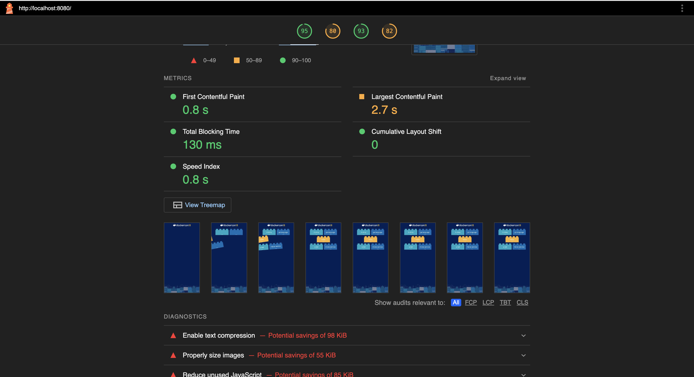

# Agile-NFE Framework

*Tools Used for this framework.*

*Jenkins dashboard displaying the CI/CD pipeline execution status.*

*Docker containers running for the application deployment.*

*SonarQube analysis report showing code quality metrics.*

*Datadog monitoring dashboard visualizing application performance metrics from JMeter tests.*

*Datadog monitoring dashboard visualizing application containers.*

*Datadog monitoring dashboard visualizing Jenkins.*

*Gremlin dashboard showing experiments.*

*Screenshot of the application user interface.*

*Screenshot of the jenkins build success mail.*

*Screenshot of the jenkins build failure mail.*

*Screenshot of the showing datadog dashboard report attachment which got in mail.*

*Screenshot of the showing slack notification.*

*Screenshot of the showing jira stroy updated with pipeline job status.*

*Screenshot of the showing lighthouse dashboard report attachment which got in mail.*

*Screenshot of the showing PA11Y Accessibility Dashboard & Report*

---