# Agile-NFE Framework - Jenkins Pipeline Documentation

This `Jenkinsfile` defines a CI/CD pipeline for automating the deployment of the application and ensuring it complies with non-functional engineering (NFE) standards. The pipeline covers key aspects such as **performance testing**, **static code scanning**, and **chaos engineering**. Once all stages are successfully completed, an email is triggered to stakeholders, indicating that the application is ready for deployment.

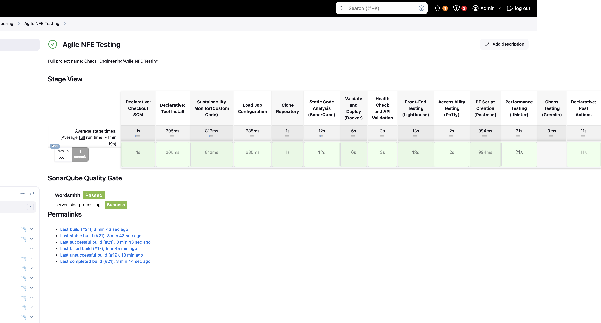
*Jenkins dashboard displaying the CI/CD pipeline execution status.*

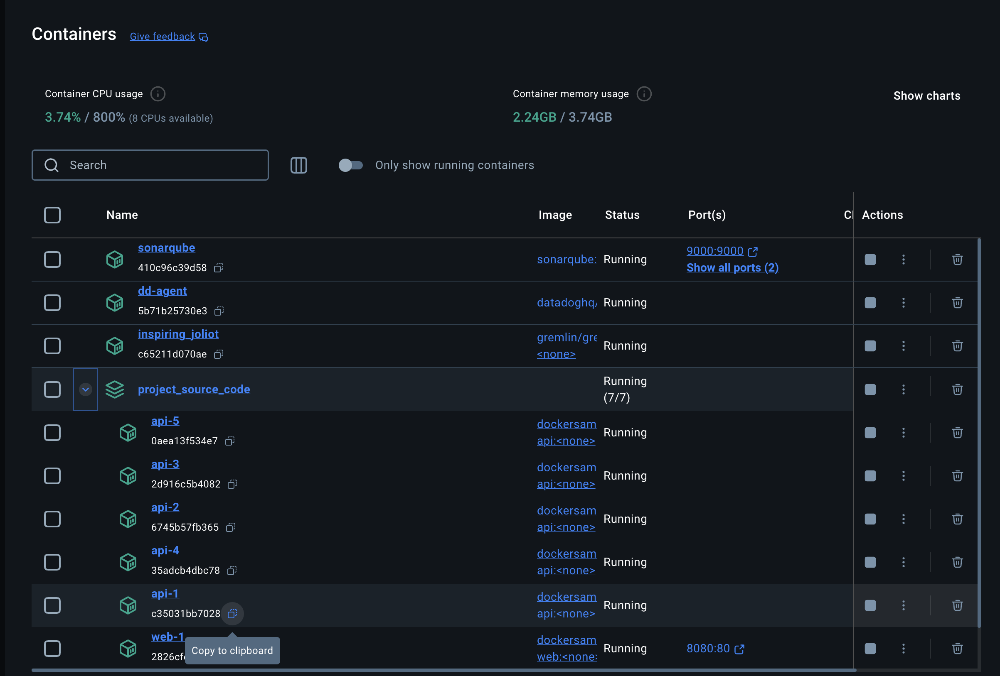
*Docker containers running for the application deployment.*

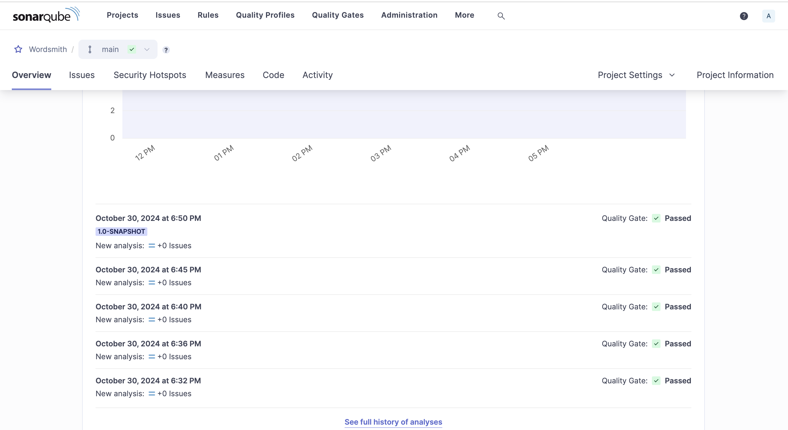
*SonarQube analysis report showing code quality metrics.*

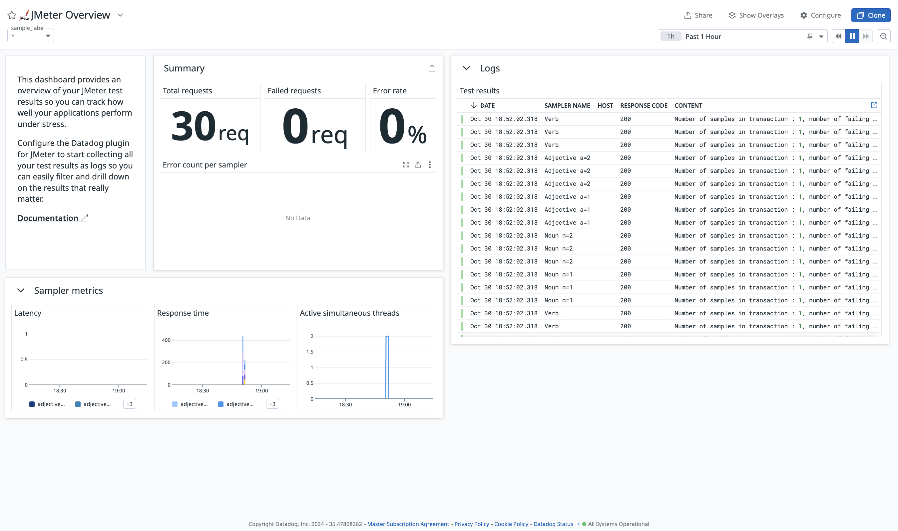
*Datadog monitoring dashboard visualizing application performance metrics from JMeter tests.*

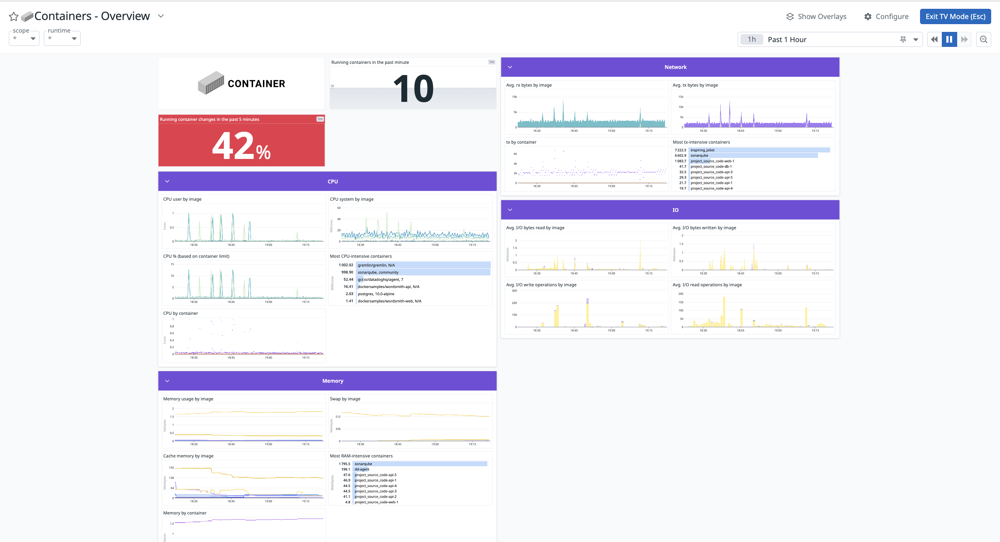
*Datadog monitoring dashboard visualizing application containers.*

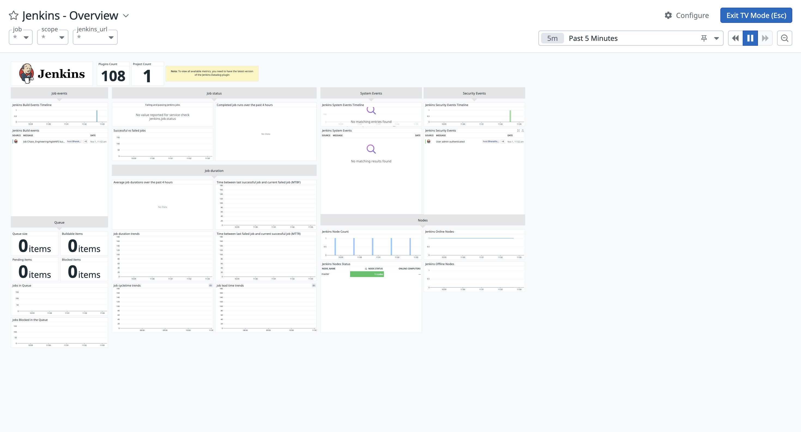
*Datadog monitoring dashboard visualizing Jenkins.*

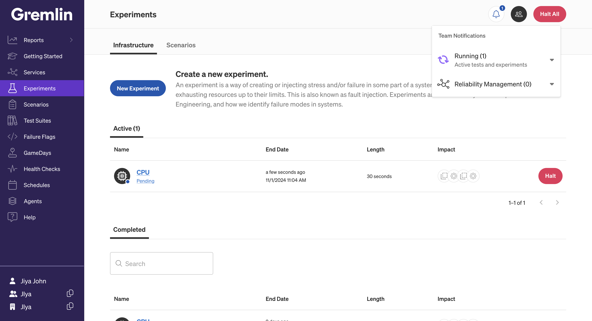
*Gremlin dashboard showing experiments.*

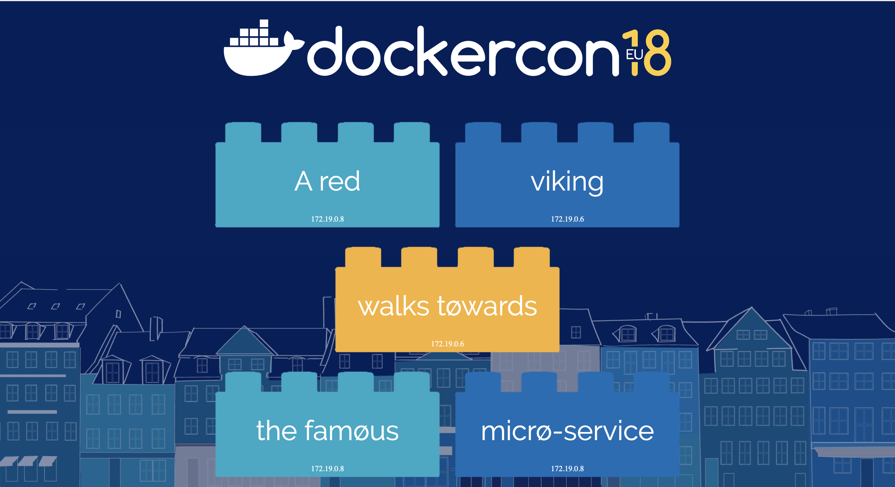
*Screenshot of the application user interface.*

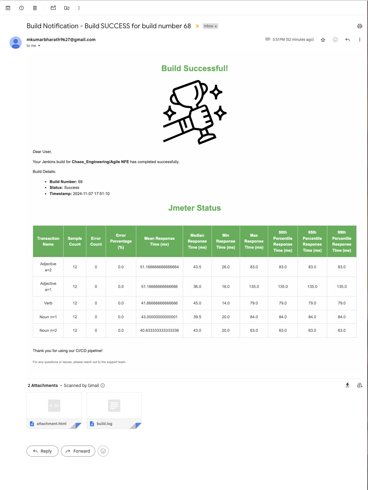
*Screenshot of the jenkins build success mail.*

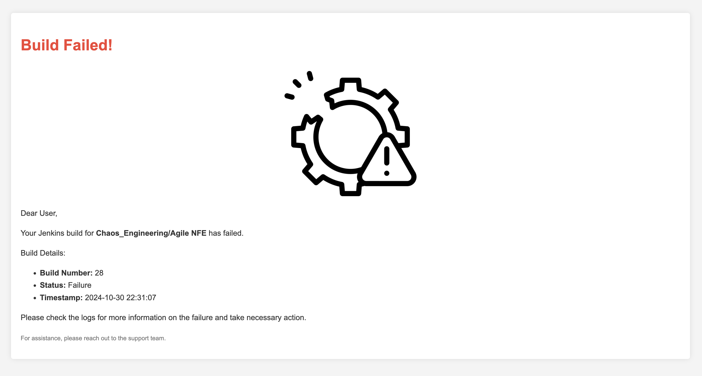
*Screenshot of the jenkins build failure mail.*

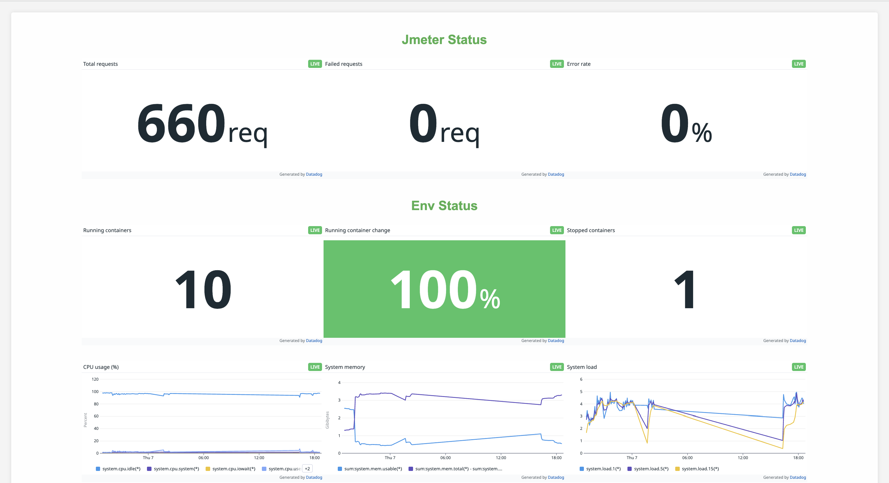
*Screenshot of the showing datadog dashboard report attachment which got in mail.*

## Shift-Left or Shift-Right Approach?
This pipeline follows a **shift-left approach** by integrating testing (performance and static code analysis) early in the CI/CD process. Shift-left practices help catch issues earlier in the development cycle, minimizing risks and reducing the cost of fixing defects. Additionally, chaos engineering introduces a **shift-right component** by validating the resilience of the application in production-like scenarios, ensuring that the system behaves reliably under real-world conditions.

## Pipeline Stages

### 1. **Load Configuration**
- Reads the YAML configuration file (`configfile.yml`).
- Sets environment variables for JMeter and chaos experiments.
- Loads project details such as GitHub repository URL and branch name.

### 2. **Clone Repository**
- Clones the source code from the specified GitHub repository and branch.

### 3. **Static Code Analysis (SonarQube)**
- Uses SonarQube to perform static code analysis.
- Requires a configured SonarQube installation named `Wordsmith` in Jenkins.
- Uses credentials from Jenkins (`SonarQube_Wordsmith`) to authenticate.
- Executes Maven commands to analyze code and submit reports to SonarQube.

#### SonarQube Configuration
- Ensure SonarQube is installed and accessible at `http://localhost:9000`.
- In Jenkins:
  1. Go to **Manage Jenkins** -> **Global Tool Configuration**.
  2. Under **SonarQube Servers**, add a new server with the name **Wordsmith**.
  3. Create a **SonarQube Token** and store it in Jenkins Credentials with the ID `SonarQube_Wordsmith`.

- Maven command used:
  ```bash
  mvn clean verify sonar:sonar \
    -Dsonar.projectKey=<project_key> \
    -Dsonar.projectName=<project_name> \
    -Dsonar.host.url=<sonarqube_url> \
    -Dsonar.login=<SONAR_TOKEN>
  ```

### 4. **Validate and Deploy Docker**
- Checks if Docker is running on the Mac node.
- Builds and deploys the application using Docker Compose.
- Verifies if the containers are running post-deployment.

### 5. **JMeter Performance Testing**
- Executes performance tests using JMeter if enabled in the configuration.
- Generates reports in HTML format at the specified directory.

### 6. **Run Chaos Experiment**
- Initiates a CPU-based chaos experiment using Gremlin.
- Requires Gremlin API credentials in Jenkins (`GREMLIN_API_KEY` and `GREMLIN_TEAM_ID`).
- Logs the attack details and provides a link to view them in the Gremlin dashboard.

## Pros of This Approach
1. **Early Defect Detection**: Catches code quality and performance issues early in the development cycle (shift-left).
2. **Automated Compliance**: Ensures that the application meets NFE standards such as code quality, performance, and reliability.
3. **Improved System Resilience**: Chaos experiments help validate the application's behavior under stress (shift-right).
4. **End-to-End Automation**: Minimizes manual effort by automating the entire process from testing to deployment readiness notifications.

## Post Execution Actions
- **Always**: Cleans up the workspace after execution.
- **Success**: Logs success message and triggers an email to stakeholders indicating deployment readiness.
- **Failure**: Logs failure message and prompts for log review.

## Prerequisites
1. **Jenkins Setup**: Ensure Jenkins is installed and running with your agent configured.
2. **SonarQube**: Accessible at `http://localhost:9000` with the project configuration.
3. **Docker**: Installed and running on the Mac system.
4. **JMeter**: Installed and available at the path specified in the configuration.
5. **Gremlin**: API credentials configured in Jenkins for chaos experiments.

## How to Use
1. Update `configfile.yml` with relevant configurations.
2. Ensure all prerequisites are fulfilled.
3. Run the pipeline from Jenkins and monitor the logs for each stage.

## Install and Use Gremlin with Docker
1. Store your Gremlin agent credentials as environment variables, for example
```bash
export GREMLIN_TEAM_ID=your_team_id
```
```bash
export GREMLIN_TEAM_SECRET=your_secert_key
```
2. Next run the Gremlin Daemon in a Container.Use docker run to pull the official Gremlin Docker image and run the Gremlin daemon
```bash
docker run -d --net=host \
  --cap-add=NET_ADMIN --cap-add=SYS_BOOT --cap-add=SYS_TIME \
  --cap-add=KILL \
  -v $PWD/var/lib/gremlin:/var/lib/gremlin \
  -v $PWD/var/log/gremlin:/var/log/gremlin \
  -v /var/run/docker.sock:/var/run/docker.sock \
  -e GREMLIN_TEAM_ID="$GREMLIN_TEAM_ID" \
  -e GREMLIN_TEAM_SECRET="$GREMLIN_TEAM_SECRET" \
  -e GREMLIN_CLIENT_TAGS="foo=bar" \
  gremlin/gremlin daemon
```
3. Use `docker ps `to see all running Docker containers
4. Jump into your Gremlin container with an interactive shell (replace b281e749ac33 with the real ID of your Gremlin container)
```bash
sudo docker exec -it b281e749ac33 /bin/bash
```
5. From within the container, check out the available attack types:
```bash
gremlin help attack-container
```


## Troubleshooting
- If Docker is not running, start it and retry.
- For SonarQube login failures, ensure the correct token is used.
- Verify Gremlin credentials if the chaos experiment fails to initiate.

## Pipeline Execution
This pipeline automates the entire CI/CD workflow, ensuring code quality, performance testing, and resilience checks through chaos engineering.

## Reference

 - [DataDog](https://app.datadoghq.com/)
 - [Installing SonarQube in Docker](https://medium.com/@HoussemDellai/setup-sonarqube-in-a-docker-container-3c3908b624df)
 - [Installing Jenkins in Docker](https://octopus.com/blog/jenkins-docker-install-guide)
 - [Gremlin Trial Account](https://www.gremlin.com/trial)
