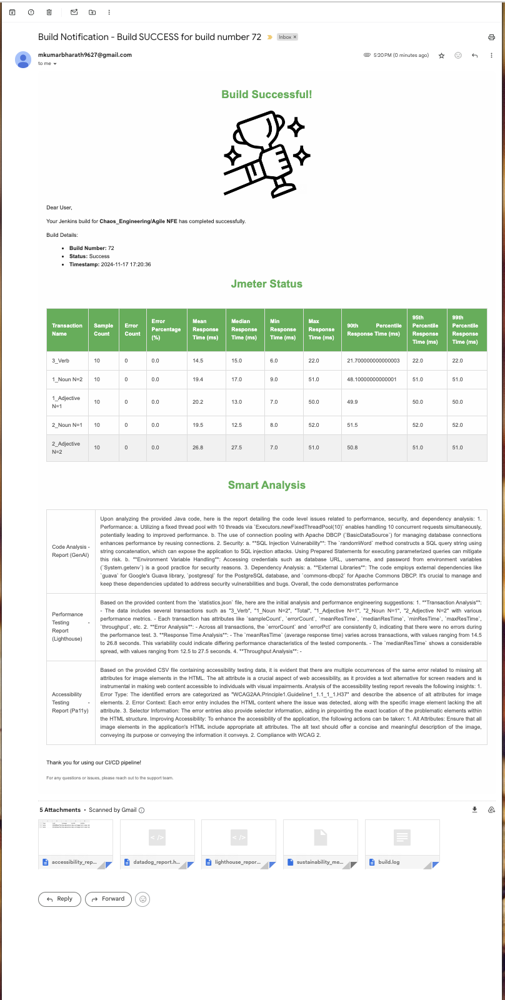
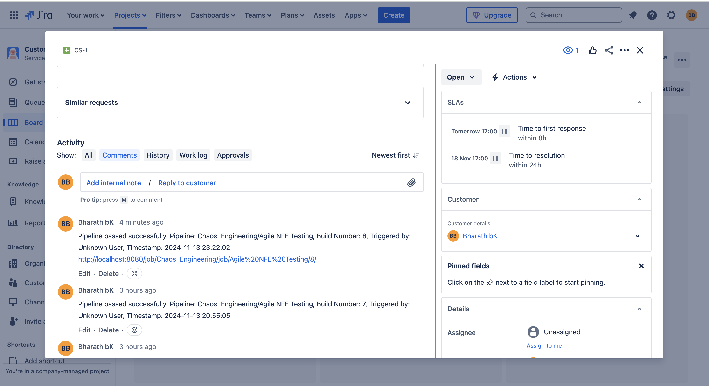
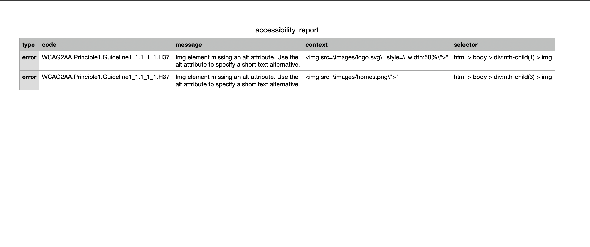

# Agile-NFE Framework - Jenkins Pipeline Documentation
## Introduction

The **Agile-NFE Framework** is a comprehensive Continuous Integration and Continuous Deployment (CI/CD) pipeline designed to automate the deployment of applications while ensuring they meet **Non-Functional Engineering (NFE)** standards. This framework integrates key engineering practices such as **performance testing**, **static code analysis**, **chaos engineering**, **frontend testing with Lighthouse**, and **accessibility testing** to ensure that the application is not only functional but also reliable, resilient, performant, and accessible under real-world conditions.

The framework adopts a **Shift-Left** approach by incorporating performance and static code checks early in the development process, minimizing risks and costs associated with defect detection. Additionally, it introduces a **Shift-Right** element through chaos engineering, validating the application’s resilience and behavior in production-like environments, which helps ensure that the application can handle unexpected failures and maintain stability.

With seamless integrations for **Slack Notifications**, **Email Updates**, and **Jira Story Updates**, the Agile-NFE Framework ensures stakeholders are always informed of the latest build status, performance scan results, and application health. **Slack Notifications** keep teams up to date by sending messages to the designated Slack channels when builds and performance scans are completed. **Email notifications** are sent to configured recipients with the build results and performance metrics. Additionally, the framework automatically updates the linked **Jira story** with the build status and performance testing results, ensuring full traceability and visibility across the team.

By automating these critical processes, the Agile-NFE Framework promotes the development of high-quality, production-ready software that adheres to performance, security, and accessibility standards, while fostering rapid, continuous delivery in a collaborative and efficient Agile environment.

---

*Jenkins dashboard displaying the CI/CD pipeline execution status.*


*Docker containers running for the application deployment.*


*SonarQube analysis report showing code quality metrics.*


*Datadog monitoring dashboard visualizing application performance metrics from JMeter tests.*


*Datadog monitoring dashboard visualizing application containers.*


*Datadog monitoring dashboard visualizing Jenkins.*


*Gremlin dashboard showing experiments.*


*Screenshot of the application user interface.*


*Screenshot of the jenkins build success mail.*


*Screenshot of the jenkins build failure mail.*


*Screenshot of the showing datadog dashboard report attachment which got in mail.*


*Screenshot of the showing slack notification.*


*Screenshot of the showing jira stroy updated with pipeline job status.*


*Screenshot of the showing lighthouse dashboard report attachment which got in mail.*



*Screenshot of the showing PA11Y Accessibility Dashboard & Report*

---

## Prerequisites

1. **Jenkins Setup**: Ensure Jenkins is installed and running with your agent configured.
2. **SonarQube**: Accessible at `http://localhost:9000` with the project configuration.
3. **Docker**: Installed and running on the Mac system.
4. **JMeter**: Installed and available at the path specified in the configuration.
5. **Gremlin**: API credentials configured in Jenkins for chaos experiments.
6. **Lighthouse**: Installed and running on the Mac system.

Ensure the following plugins are installed and configured in Jenkins:

1. **Slack Notifications Plugin**  
   Enables Jenkins to send notifications to Slack channels based on job status.

2. **NodeJS Plugin**  
   Provides support for running NodeJS applications within Jenkins.

3. **Datadog Plugin**  
   Integrates Jenkins with Datadog to send metrics and job statuses for monitoring.

4. **Maven Integration Plugin**  
   Required for projects using Maven for build automation. This plugin allows Jenkins to manage Maven builds.

5. **Sonar Scanner Plugin**  
   Integrates SonarQube analysis into Jenkins jobs to provide code quality reports.

6. **Sonar Quality Gate Plugin**  
   Ensures that code meets the defined quality gates in SonarQube before progressing.

7. **Email Extension Plugin**  
   Provides enhanced email notification capabilities for build success, failure, and other status updates.

## Installation and Configuration

Each plugin can be installed through the Jenkins Plugin Manager:

1. Go to **Jenkins Dashboard > Manage Jenkins > Manage Plugins**.
2. Search for each plugin by name and install it.
3. After installation, configure each plugin as needed for your environment (e.g., Slack Webhook URL, Datadog API key, SonarQube connection settings).

## Additional Configuration

Some plugins may require further setup, such as:

- **Slack Notifications**: Configure Slack Webhook and select channels for notifications.
- **Datadog**: Set up API and application keys to allow Jenkins to send data to Datadog.
- **SonarQube**: Ensure connection to SonarQube server and define quality gates.

Refer to each plugin’s documentation for detailed configuration instructions.

By ensuring these plugins are properly configured, Jenkins can automate builds, perform quality checks, and provide comprehensive notifications and monitoring.

---

## Shift-Left or Shift-Right Approach?
This pipeline follows a **shift-left approach** by integrating testing (performance and static code analysis) early in the CI/CD process. Shift-left practices help catch issues earlier in the development cycle, minimizing risks and reducing the cost of fixing defects. Additionally, chaos engineering introduces a **shift-right component** by validating the resilience of the application in production-like scenarios, ensuring that the system behaves reliably under real-world conditions.

---

## Pipeline Stages

### 1. **Load Configuration**
- Reads the YAML configuration file (`configfile.yml`).
- Sets environment variables for JMeter and chaos experiments.
- Loads project details such as GitHub repository URL and branch name.

### 2. **Clone Repository**
- Clones the source code from the specified GitHub repository and branch.

### 3. **Static Code Analysis (SonarQube)**
- Uses SonarQube to perform static code analysis.
- Requires a configured SonarQube installation named `Wordsmith` in Jenkins.
- Uses credentials from Jenkins (`SonarQube_Wordsmith`) to authenticate.
- Executes Maven commands to analyze code and submit reports to SonarQube.

#### SonarQube Configuration
- Ensure SonarQube is installed and accessible at `http://localhost:9000`.
- In Jenkins:
  1. Go to **Manage Jenkins** -> **Global Tool Configuration**.
  2. Under **SonarQube Servers**, add a new server with the name **Wordsmith**.
  3. Create a **SonarQube Token** and store it in Jenkins Credentials with the ID `SonarQube_Wordsmith`.

- Maven command used:
  ```bash
  mvn clean verify sonar:sonar \
    -Dsonar.projectKey=<project_key> \
    -Dsonar.projectName=<project_name> \
    -Dsonar.host.url=<sonarqube_url> \
    -Dsonar.login=<SONAR_TOKEN>
  ```

### 4. **Validate and Deploy Docker**
- Checks if Docker is running on the Mac node.
- Builds and deploys the application using Docker Compose.
- Verifies if the containers are running post-deployment.

### 5. **JMeter Performance Testing**
- Executes performance tests using JMeter if enabled in the configuration.
- Generates reports in HTML format at the specified directory.

### 6. **Run Chaos Experiment**
- Initiates a CPU-based chaos experiment using Gremlin.
- Requires Gremlin API credentials in Jenkins (`GREMLIN_API_KEY` and `GREMLIN_TEAM_ID`).
- Logs the attack details and provides a link to view them in the Gremlin dashboard.

### 7. **Run Frontend Performance Testing with Lighthouse**
- Uses Lighthouse to perform a performance scan on the specified webpage.
- Generates a detailed performance report, including metrics like page load time, accessibility, SEO, and best practices.
- **Prerequisites**: Ensure that Lighthouse is installed and configured in Jenkins for scanning.

### 8. **Accessibility Testing with Pa11y**

- Uses **Pa11y** to perform accessibility scans on specified webpages.
- Provides detailed accessibility reports, including issues and WCAG compliance.
- **Prerequisites**: Ensure that Pa11y is installed and configured in your environment.


### 9. **Notifications and Updates**
- **Slack Notification**: Sends a notification to the designated Slack channel once the build and performance scan are completed.
- **Email Notification**: Sends an email update to the configured recipients, providing the build and scan results.
- **Jira Update**: Automatically updates the Jira story linked to the current build with the build status and performance testing results.

## Post Execution Actions
- **Always**: Cleans up the workspace after execution.
- **Success**: Logs success message and triggers an email to stakeholders indicating deployment readiness.
- **Failure**: Logs failure message and prompts for log review.

---

## Pros of the Agile-NFE Framework

### 1. Early Detection of Issues (Shift-Left Approach)
The framework integrates performance testing, static code analysis, and other quality checks early in the development process, enabling faster detection of issues. This minimizes the cost and risk of defects surfacing later in the development cycle, which is key to achieving high-quality software.

### 2. Continuous Monitoring and Quality Control
By including SonarQube for static code analysis, the framework ensures that every code commit is scrutinized for quality issues, improving code maintainability and preventing technical debt. The use of JMeter for performance testing further ensures that any performance bottlenecks are identified and resolved promptly.

### 3. Enhanced System Resilience (Shift-Right Approach)
The chaos engineering component of the framework introduces resilience testing, validating the application’s ability to handle unexpected failures and operate reliably under production-like conditions. This proactive approach helps ensure high availability and fault tolerance in real-world usage.

### 4. Automated Frontend Performance Testing with Lighthouse
The integration of Lighthouse into the pipeline automates frontend performance testing, enabling teams to monitor critical frontend metrics such as page load time, SEO, accessibility, and best practices continuously. This ensures that user experience is prioritized and optimized throughout the development process.

### 5. Comprehensive Accessibility Testing
By including Pa11y for automated accessibility testing, the framework ensures that the application is compliant with accessibility standards (such as WCAG), improving inclusivity and ensuring the application is usable by a broader audience.

### 6. Seamless Integration with Notifications and Issue Tracking
The framework includes automatic Slack Notifications and Email Notifications, providing timely updates to team members about build and performance scan results. Jira Updates ensure that the associated Jira story is updated with the latest status, performance metrics, and results, keeping everyone aligned on progress.

### 7. End-to-End Automation
The framework automates critical tasks such as build verification, testing, deployment readiness, and stakeholder notification, reducing manual intervention and enabling faster release cycles. This automation boosts productivity and ensures that the application is always production-ready.

### 8. Improved Collaboration Across Teams
The integration with Jira, Slack, and Email enhances communication across different teams (e.g., developers, testers, and project managers), ensuring that everyone has up-to-date information on the status of the build and testing phases. This promotes collaboration and faster decision-making.

### 9. Scalability and Flexibility
With the ability to scale performance and chaos testing based on configurable parameters, the framework adapts to various project needs, whether for small applications or large-scale, distributed systems. The framework's flexibility ensures it can grow with the project.

### 10. Complete Feedback Loop
The combination of static analysis, performance testing, chaos experiments, and frontend testing establishes a complete feedback loop from development through production, ensuring that the software is continuously validated for quality, performance, and resilience.

### 11. Efficient and Cost-Effective
By shifting testing and quality checks earlier in the development lifecycle, the framework helps reduce the costs associated with late-stage defect detection and remediation. This proactive testing and monitoring approach saves time and effort in the long run.

### 12. Comprehensive Reporting
Detailed reports generated from performance scans, code quality analysis, and accessibility tests ensure that stakeholders have access to clear, actionable insights about the application’s quality, performance, and compliance, helping in data-driven decision-making.

### 13. Consistent Build and Deployment Process
The pipeline ensures that builds are tested consistently, deployed in a controlled manner, and updated with relevant notifications, making the deployment process predictable and reliable, with minimal risk of issues arising during deployment.

___

## How to Use
1. Update `configfile.yml` with relevant configurations.
2. Ensure all prerequisites are fulfilled.
3. Run the pipeline from Jenkins and monitor the logs for each stage.

___

## Troubleshooting
- If Docker is not running, start it and retry.
- For SonarQube login failures, ensure the correct token is used.
- Verify Gremlin credentials if the chaos experiment fails to initiate.

## Pipeline Execution
This pipeline automates the entire CI/CD workflow, ensuring code quality, performance testing, and resilience checks through chaos engineering.

## Reference

 - [DataDog](https://app.datadoghq.com/)
 - [Installing SonarQube in Docker](https://medium.com/@HoussemDellai/setup-sonarqube-in-a-docker-container-3c3908b624df)
 - [Installing Jenkins in Docker](https://octopus.com/blog/jenkins-docker-install-guide)
 - [Gremlin Trial Account](https://www.gremlin.com/trial)
 - [How to Send Slack Notifications From Jenkins](https://youtu.be/EDVZli8GdUM?si=dM5tRvyvZk9Dviko)
 - [How to Integrate Jira With Jenkins](https://youtu.be/-KrlCWVPfJM?si=-SXdIDdTYdNnK3ms)
 - [How to setup Pa11y and its Dashboard](https://pa11y.org/)
