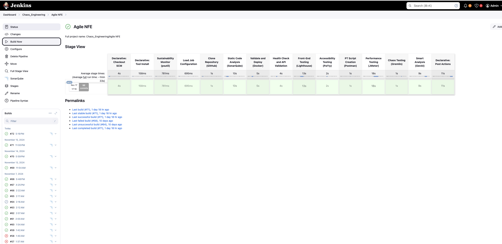
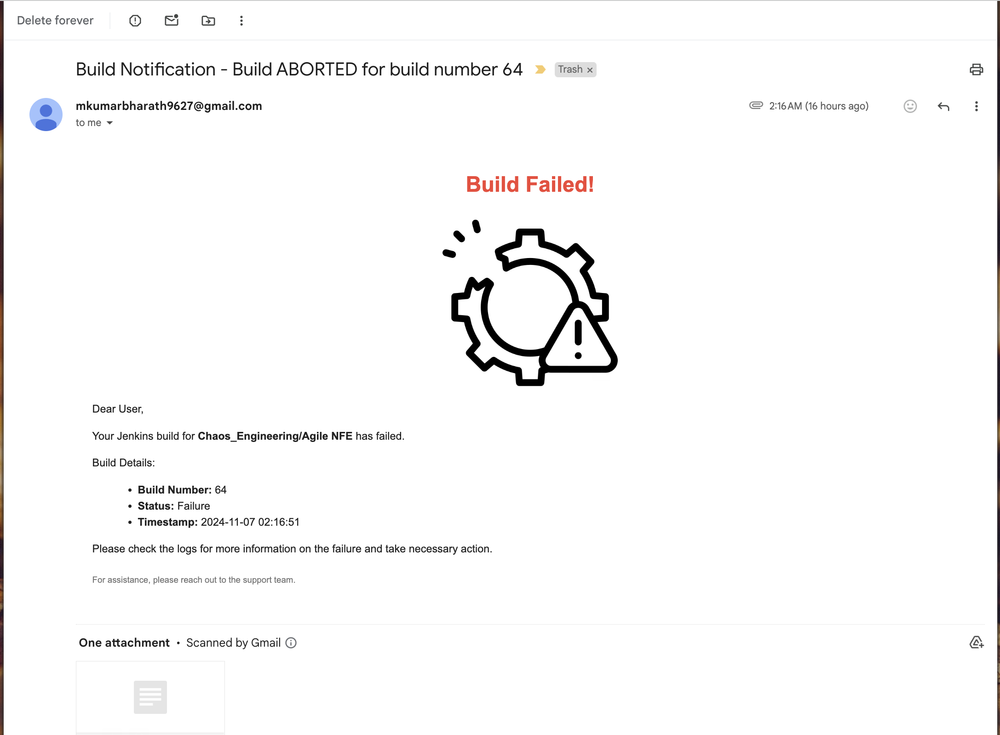

# Agile-NFE Framework - Jenkins Pipeline Documentation

This `Jenkinsfile` defines a CI/CD pipeline that automates the deployment of an application while ensuring it meets essential non-functional engineering (NFE) standards. The pipeline includes key quality and reliability checks like **performance testing**, **static code analysis**, and **chaos engineering**. Once all stages complete successfully, an email is sent to stakeholders, indicating that the application is ready for deployment.

## Overview of Pipeline Stages

1. **Performance Testing**: Validates the application's speed and stability using JMeter.
2. **Static Code Scanning**: Checks code quality using SonarQube.
3. **Chaos Engineering**: Tests application resilience using Gremlin to ensure it can handle unexpected disruptions.
4. **CI/CD Automation**: Manages the pipeline with Jenkins.
5. **Monitoring**: Uses Datadog for real-time insights into application health.
6. **Source Control Management**: Manages code with GitHub.

### Shift-Left and Shift-Right Testing
This pipeline follows a **shift-left approach**, integrating code analysis and performance testing early in the development cycle to catch issues sooner, reducing risks and fixing costs. Additionally, a **shift-right component** is introduced through chaos engineering, which simulates real-world failures, ensuring the application is resilient in production-like conditions.

## Application Setup Details
- **Backend Language**: Java
- **Frontend Server**: Nginx
- **Database**: PostgreSQL
- **Environment**: Docker containers

## Pipeline Workflow
### 1. **Load Configuration**
   - Reads the YAML configuration file (`configfile.yml`) to set environment variables for JMeter and chaos experiments.
   - Loads project details such as the GitHub repository URL and branch name.

### 2. **Clone Repository**
   - Clones the application source code from the specified GitHub repository and branch.

### 3. **Static Code Analysis (SonarQube)**
   - Uses SonarQube to analyze code quality and track improvements.
   - Requires a configured SonarQube installation named `Wordsmith` in Jenkins.
   - Uses Jenkins credentials (`SonarQube_Wordsmith`) for authentication.
   - Maven command:
   ```bash
   mvn clean verify sonar:sonar -Dsonar.projectKey=<project_key> -Dsonar.projectName=<project_name> -Dsonar.host.url=<sonarqube_url> -Dsonar.login=<SONAR_TOKEN>
   ```

### 4. **Validate and Deploy Docker**
   - Ensures Docker is running on the Mac node.
   - Builds and deploys the application using Docker Compose.

### 5. **JMeter Performance Testing**
   - Executes performance tests using JMeter.
   - Generates performance reports in HTML format.

### 6. **Run Chaos Experiment (Gremlin)**
   - Initiates a CPU-based chaos experiment using Gremlin.
   - Requires Gremlin API credentials in Jenkins.

## Screenshots

-  - *Pipeline execution status*
-  - *Docker containers running for deployment*
-  - *SonarQube code quality metrics*
-  - *Datadog monitoring application performance*
-  - *Gremlin chaos experiments*
-  - *Application user interface*
-  - *Jenkins build success mail*
-  - *Jenkins build failure mail*

## Benefits
1. **Early Defect Detection**: Catches code quality and performance issues early (shift-left).
2. **Automated Compliance**: Ensures code quality, performance, and resilience compliance.
3. **Improved Resilience**: Chaos engineering validates system behavior under stress (shift-right).
4. **End-to-End Automation**: Reduces manual effort by automating testing and notifications.

## Prerequisites
1. **Jenkins**: Installed with necessary plugins and configured agents.
2. **SonarQube**: Accessible at `http://localhost:9000` and configured in Jenkins.
3. **Docker**: Installed and running.
4. **JMeter**: Installed and accessible in the configuration path.
5. **Gremlin**: API credentials configured in Jenkins.

## Gremlin Setup for Chaos Engineering

1. Set Gremlin agent credentials as environment variables:
   ```bash
   export GREMLIN_TEAM_ID=your_team_id
   export GREMLIN_TEAM_SECRET=your_secret_key
   ```
2. Run Gremlin Daemon in Docker:
   ```bash
   docker run -d --net=host --cap-add=NET_ADMIN --cap-add=SYS_BOOT --cap-add=SYS_TIME --cap-add=KILL    -v $PWD/var/lib/gremlin:/var/lib/gremlin -v $PWD/var/log/gremlin:/var/log/gremlin    -v /var/run/docker.sock:/var/run/docker.sock -e GREMLIN_TEAM_ID="$GREMLIN_TEAM_ID"    -e GREMLIN_TEAM_SECRET="$GREMLIN_TEAM_SECRET" -e GREMLIN_CLIENT_TAGS="foo=bar" gremlin/gremlin daemon
   ```
3. Check running containers: `docker ps`
4. Access the Gremlin container for testing:
   ```bash
   sudo docker exec -it <container_id> /bin/bash
   ```

## Troubleshooting
- **Docker Issues**: Start Docker if it’s not running.
- **SonarQube Login Failures**: Check for correct SonarQube token.
- **Gremlin Experiment Failures**: Verify Gremlin credentials.

## Post Execution Actions
- **Always**: Cleans up workspace.
- **Success**: Sends deployment readiness email to stakeholders.
- **Failure**: Sends notification with logs for review.

## Pipeline Execution
This pipeline automates CI/CD, ensuring high standards for code quality, performance, and resilience.

## Reference Links
- [DataDog Monitoring](https://app.datadoghq.com/)
- [SonarQube in Docker](https://medium.com/@HoussemDellai/setup-sonarqube-in-a-docker-container-3c3908b624df)
- [Jenkins with Docker](https://octopus.com/blog/jenkins-docker-install-guide)
- [Gremlin Trial Account](https://www.gremlin.com/trial)

